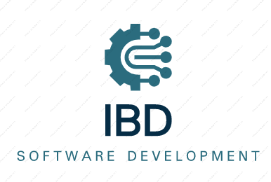

<a name="readme-top"></a>

<!--
HOW TO USE:
This is an example of how you may give instructions on setting up your project locally.

Modify this file to match your project and remove sections that don't apply.

REQUIRED SECTIONS:
- Table of Contents
- About the Project
  - Built With
  - Live Demo
- Getting Started
- Authors
- Future Features
- Contributing
- Show your support
- Acknowledgements
- License

OPTIONAL SECTIONS:
- FAQ

After you're finished please remove all the comments and instructions!
-->

<div align="center">
  <!-- You are encouraged to replace this logo with your own! Otherwise you can also remove it. -->
  
  <br/>

  <h3><b>Iqbal Belay Diego</b></h3>

</div>

<!-- TABLE OF CONTENTS -->

# 📗 Table of Contents

- [📗 Table of Contents](#-table-of-contents)
- [📖 Capstone-Module-2 ](#-capstone-module-2-)
  - [🛠 Built With ](#-built-with-)
    - [Tech Stack ](#tech-stack-)
    - [Key Features ](#key-features-)
  - [🚀 Live Demo ](#-live-demo-)
  - [🎥 Video Demo ](#-video-demo-)
  - [💻 Getting Started ](#-getting-started-)
    - [Prerequisites](#prerequisites)
    - [Setup](#setup)
    - [Install](#install)
    - [Usage](#usage)
    - [Run tests](#run-tests)
    - [Deployment](#deployment)
    - [Issues](#issues)
  - [👥 Authors ](#-authors-)
  - [🔭 Future Features ](#-future-features-)
  - [🤝 Contributing ](#-contributing-)
  - [⭐️ Show your support ](#️-show-your-support-)
  - [🙏 Acknowledgments ](#-acknowledgments-)
  - [❓ FAQ (OPTIONAL) ](#-faq-optional-)
  - [📝 License ](#-license-)

<!-- PROJECT DESCRIPTION -->

# 📖 Capstone-Module-2 <a name="about-project"></a>


**Capstone-Module-2** is and educational project and is about building web application based on an external API. We selected  [TVmaze API](https://www.tvmaze.com/api) that provides data about a movies and build the webapp around it. Our webapp has 3 user interfaces.

## 🛠 Built With <a name="built-with"></a>

### Tech Stack <a name="tech-stack"></a>


<details>
  <summary>Client</summary>
  <ul>
    <li><a href="https://reactjs.org/">JavaScript</a></li>
  </ul>
</details>

<details>
  <summary>Server</summary>
  <ul>
    <li><a href="https://expressjs.com/">Express.js</a></li>
  </ul>
</details>

<details>
<summary>Database</summary>
  <ul>
    <li><a href="https://www.postgresql.org/">PostgreSQL</a></li>
  </ul>
</details>

<!-- Features -->

### Key Features <a name="key-features"></a>


- **Home Page**
- **Detail pop up with Comments**
- **Detail pop up for Reservation**

<p align="right">(<a href="#readme-top">back to top</a>)</p>

<!-- LIVE DEMO -->

## 🚀 Live Demo <a name="live-demo"></a>


- [Live Demo Link](https://yourdeployedapplicationlink.com)


<p align="right">(<a href="#readme-top">back to top</a>)</p>

##  🎥 Video Demo <a name="video-demo"></a>

- [Here](https://drive.google.com/file/d/1_00POc1URFVXSbLT8MkLxsEqqMkPSuMz/view?usp=sharing) is a video of the project walking you through the website and talking over the main features. 

<p align="right">(<a href="#readme-top">back to top</a>)</p>

<!-- GETTING STARTED -->

## 💻 Getting Started <a name="getting-started"></a>


To get a local copy up and running, follow these steps.

### Prerequisites

In order to do this project you need:
> A knowledge of:
> HTML5/CSS3
> JavaScript
> webpack
> linters   -> eslint and stylelint
> APIs
> ES6
> AAA pattern testing
> git and git-flow
> project management using Kanban board 


### Setup

Clone this repository to your desired folder:


```sh
  cd my-folder
  git clone git@github.com:Iqbal-Elham/Capstone-module-2.git
```

### Install

Install this project with:


```sh
  cd Capstone-module-2
  npm install
  npm audit fix --force (optional)-> only if there is conflict in node version.
```


### Usage

To run the project, execute the following command:


Example command:

```sh
  npm run build
  npm start
```

### Run tests

To run tests, run the following command:


```sh
  npm run test
```

### Deployment

You can deploy this project using:

> GitHub pages
> [netlify](https://www.netlify.com/)
> [000webhost](https://www.000webhost.com/)

<p align="right">(<a href="#readme-top">back to top</a>)</p>
### Issues
To create an issues for this project
> Go to [issues page](https://github.com/Iqbal-Elham/Capstone-module-2/issues)
<!-- AUTHORS -->

## 👥 Authors <a name="authors"></a>


👤 **Belay Birhanu G.**

- GitHub: [@githubhandle](https://github.com/belaymit)
- Twitter: [@twitterhandle](https://twitter.com/2belamit)
- LinkedIn: [LinkedIn](https://www.linkedin.com/in/belay-birhanu-144ba714b/)

👤 **Iqbal Elham**

- GitHub: [@githubhandle](https://github.com/Iqbal-Elham)
- LinkedIn: [LinkedIn](https://www.linkedin.com/in/iqbal-elham-8830aa19a)


👤 **Diego Gonzalo Cuenca Morocho**

- GitHub: [@githubhandle](https://github.com/dgcuenca)
- LinkedIn: [LinkedIn](hlinkedin.com/in/diego-cuenca)

<p align="right">(<a href="#readme-top">back to top</a>)</p>

<!-- FUTURE FEATURES -->

## 🔭 Future Features <a name="future-features"></a>


- [ ] **Contacts**
- [ ] **Gallery**


<p align="right">(<a href="#readme-top">back to top</a>)</p>

<!-- CONTRIBUTING -->

## 🤝 Contributing <a name="contributing"></a>

Contributions, issues, and feature requests are welcome!

Feel free to check the [issues page](https://github.com/belaymit/JavaScript-Capstone-Project/issues).

<p align="right">(<a href="#readme-top">back to top</a>)</p>

<!-- SUPPORT -->

## ⭐️ Show your support <a name="support"></a>


If you like this project please give it a star

<p align="right">(<a href="#readme-top">back to top</a>)</p>

<!-- ACKNOWLEDGEMENTS -->

## 🙏 Acknowledgments <a name="acknowledgements"></a>

> Give credit to everyone who inspired your codebase.

- We would like to thank Microverse Community

<p align="right">(<a href="#readme-top">back to top</a>)</p>

<!-- FAQ (optional) -->

## ❓ FAQ (OPTIONAL) <a name="faq"></a>


- **What challenges we faced while developing this web app?**

  - extracting a specific item's id when attempting to get more information from a pop-up

- **What is the output of this project?**

  - We assessed our knowledge of JavaScript, ES6, APIs, Webpack, and AAA pattern testing from this educational project.

<p align="right">(<a href="#readme-top">back to top</a>)</p>

<!-- LICENSE -->

## 📝 License <a name="license"></a>

This project is [MIT](./LICENSE) licensed.

_NOTE: we recommend using the [MIT license](https://choosealicense.com/licenses/mit/) - you can set it up quickly by [using templates available on GitHub](https://docs.github.com/en/communities/setting-up-your-project-for-healthy-contributions/adding-a-license-to-a-repository). You can also use [any other license](https://choosealicense.com/licenses/) if you wish._

<p align="right">(<a href="#readme-top">back to top</a>)</p>
